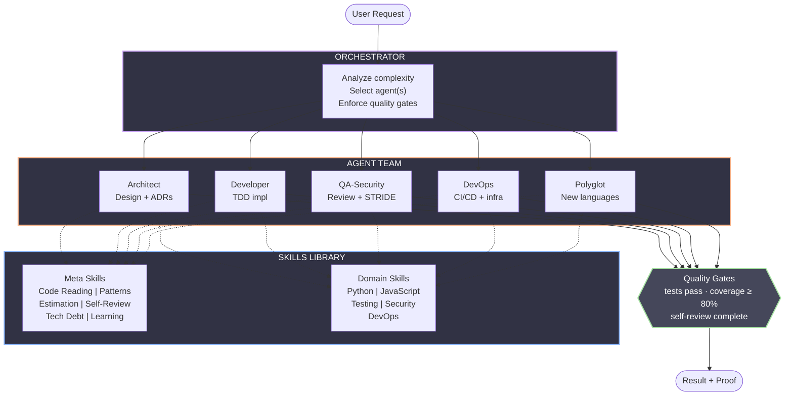
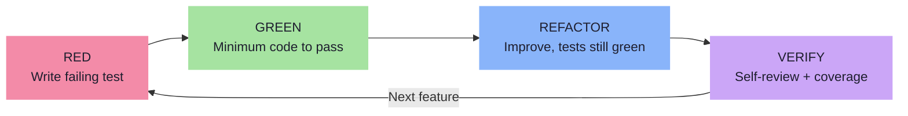

# 10X Developer Unicorn

> A Claude Code plugin that encodes the "hidden 80%" of software engineering expertise into 5 specialized agents and 13 composable skills.

[]()
[]()
[](https://claude.ai)
[](LICENSE)

## What Is This?

Most AI coding tools help with the visible 20% -- writing code, answering syntax questions, generating boilerplate. But experienced developers spend 80% of their effort on skills that are rarely taught: reading code strategically, recognizing cross-domain patterns, estimating with risk awareness, self-reviewing before anyone sees the code, and managing technical debt deliberately.

This plugin encodes those skills into a coordinated agent team that Claude Code uses automatically.

## Install

```bash
# Add the marketplace
claude plugin marketplace add aj-geddes/unicorn-team

# Install the plugin
claude plugin install unicorn-team@unicorn-team
```

Done. Claude Code discovers all 13 skills, registers event hooks, and activates the orchestrator.

## How It Works

You make a request. The orchestrator analyzes it, routes to the right agent, and enforces quality gates on the result.



Every implementation follows strict TDD:



## The Skills

### Agents (Protocol Inlined)

5 specialized agents with protocols inlined in their definitions (`agents/*.md`), keeping them off the slash command list:

| Agent | What It Does |
|-------|-------------|
| **architect** | System design, ADRs, API contracts, tradeoff analysis |
| **developer** | TDD-first implementation across Python, JS/TS, Go, Rust |
| **qa-security** | 4-layer code review, STRIDE threat modeling |
| **devops** | CI/CD pipelines, deployment strategies, runbooks |
| **polyglot** | Rapid language acquisition, cross-ecosystem pattern transfer |

### 13 Composable Skills

#### Coordination

| Skill | What It Does |
|-------|-------------|
| **orchestrator** | Routes tasks, delegates to agents, enforces quality gates |

#### Meta Skills -- The Hidden 80%

| Skill | What It Does |
|-------|-------------|
| **self-verification** | Systematic pre-commit quality checks (6-step protocol) |
| **code-reading** | Strategic codebase comprehension -- entry points, data flow, error paths |
| **pattern-transfer** | Recognize problem classes, transfer proven solutions across domains |
| **estimation** | Risk-aware PERT estimation with decomposition and confidence levels |
| **technical-debt** | Track, classify, and deliberately manage shortcuts and debt |
| **language-learning** | 5-phase protocol: zero to productive in a new language |

### Domain Skills

| Skill | Coverage |
|-------|----------|
| **python** | Type hints (3.10+), pytest, async, ruff, mypy, poetry |
| **javascript** | TypeScript, React, Node.js, Vitest, ESLint |
| **testing** | TDD protocol, mocking strategies, coverage, cross-language patterns |
| **security** | OWASP Top 10, STRIDE, input validation, secrets management |
| **domain-devops** | Docker, Kubernetes, GitHub Actions, observability stack |

Plus **hvs-skill-buddy** for skill library auditing and creation.

## Project Structure

```
unicorn-team/
├── .claude-plugin/
│   ├── plugin.json                   # Plugin manifest
│   └── marketplace.json              # Marketplace manifest
├── settings.json                     # Plugin settings
├── CLAUDE.md                         # Orchestrator activation
├── agents/                          # 5 agent definitions at plugin root
│   ├── developer.md
│   ├── architect.md
│   ├── qa-security.md
│   ├── devops.md
│   └── polyglot.md
├── .claude/
│   ├── agents -> ../../agents       # Symlink for local dev compatibility
│   └── protocols/                   # Agent reference materials
│       ├── developer/references/
│       ├── architect/references/
│       └── ...
├── skills/                          # 13 composable skills
│   ├── orchestrator/
│   │   ├── SKILL.md
│   │   └── references/
│   ├── self-verification/
│   │   ├── SKILL.md
│   │   ├── references/
│   │   └── scripts/self-review.sh
│   ├── estimation/
│   │   ├── SKILL.md
│   │   ├── references/
│   │   └── scripts/estimate.sh
│   └── ... (10 more)
├── hooks/hooks.json                  # Claude Code event hooks
├── scripts/
│   ├── validate.sh                   # Plugin structure validator
│   ├── git-pre-commit                # Git pre-commit hook
│   └── git-pre-push                  # Git pre-push hook
├── tests/                            # 94 tests
└── docs/                             # Architecture, troubleshooting
```

Each skill contains a `SKILL.md` (with YAML frontmatter for auto-discovery), optional `references/` for deep-dive content, and optional `scripts/` for automation.

## Development

```bash
git clone https://github.com/aj-geddes/unicorn-team.git
cd unicorn-team
pytest tests/ -v            # Run all 94 tests
./scripts/validate.sh       # Validate plugin structure
```

### Adding a Skill

1. Create `skills/<name>/SKILL.md` with frontmatter:
   ```yaml
   ---
   name: my-skill
   description: >-
     What it does. ALWAYS trigger on "phrase1", "phrase2".
     Use when [condition]. Different from [sibling] which [difference].
   ---
   ```
2. Keep body under 500 lines -- extract detail to `references/`
3. Co-locate scripts in `scripts/` within the skill directory
4. Run `pytest tests/ -v`

### Commit Convention

```
type(scope): description

Types: feat, fix, docs, skill, script, test, refactor
```

### Tests

```bash
pytest tests/test_plugin.py         # Plugin manifest
pytest tests/test_skills_valid.py   # SKILL.md frontmatter + size
pytest tests/test_scripts.py        # Script permissions + shebangs
pytest tests/test_hooks.py          # hooks.json validation
```

## Stats

| | Count |
|-|-------|
| Composable Skills | 13 |
| Agents | 5 |
| Reference docs | 58 |
| Scripts | 7 |
| Tests | 94 |

## License

MIT -- see [LICENSE](LICENSE).
