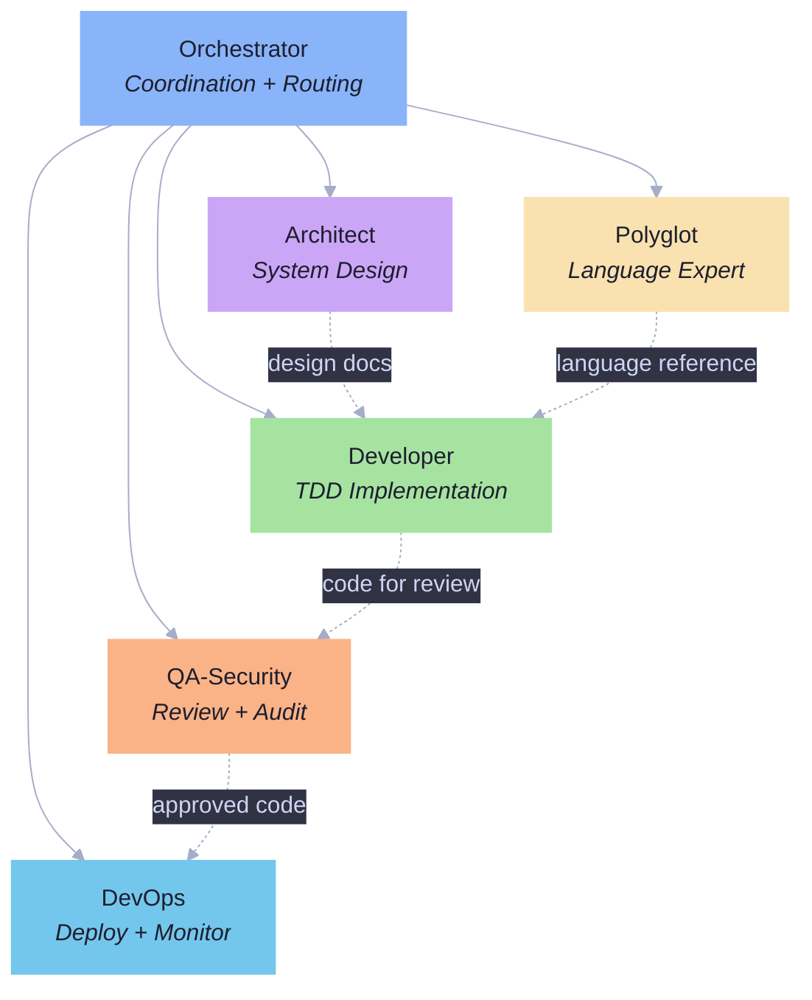
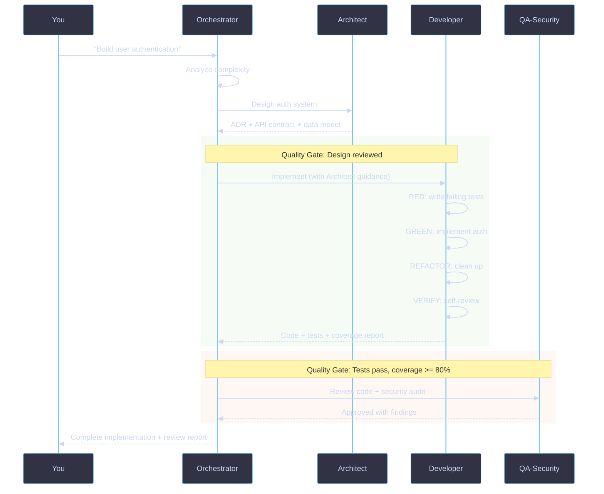

# Architecture

The 10X Developer Unicorn uses an **orchestrator-first design**: a lightweight coordinator that never implements directly, backed by 5 specialized agents that each get their own fresh 200K context window. The result is a system that scales with complexity instead of drowning in it.

---

## Design Principles

**Route, don't implement.** The orchestrator analyzes and delegates. It never writes code, creates infrastructure, or designs systems itself. Every substantial task goes to a specialist.

**Context is a public good.** Each subagent gets a fresh 200K token context window. The orchestrator stays lean (under 40K tokens) and passes only what each agent needs -- task description, relevant context, and constraints. Agents return summaries and file paths, not full outputs.

**TDD is non-negotiable.** Every implementation follows RED (failing test) -> GREEN (make it pass) -> REFACTOR (improve) -> VERIFY (self-review). No exceptions. No shortcuts.

**Quality gates at every handoff.** Every transition between agents passes through a gate: tests pass, coverage meets threshold, self-review completed, no debug code, no unresolved markers.

---

## The Agent Squad

| Agent | Role | Key Outputs |
|-------|------|-------------|
| **Orchestrator** | Routes tasks, coordinates agents, enforces quality gates | Delegation plans, aggregated results, gate status |
| **Architect** | System design, pattern selection, tradeoff analysis | ADRs, Mermaid diagrams, API contracts, data models |
| **Developer** | Full-stack TDD implementation (Python, JS/TS, Go, Rust) | Code + tests, coverage reports, self-review results |
| **QA-Security** | Code review, security audits, quality gate enforcement | Approval/rejection with findings, security reports |
| **DevOps** | CI/CD, infrastructure, deployment, monitoring | Pipelines, IaC configs, K8s manifests, observability setup |
| **Polyglot** | Language acquisition, cross-ecosystem pattern transfer | Quick references, paradigm maps, migration guides |

---

## Delegation Workflow

A complex feature request flows through multiple agents with quality gates at each transition.

---

## Routing Decision Tree

The orchestrator uses a decision tree to match tasks to agents:

| Task Type | Route | Why |
|-----------|-------|-----|
| Simple question | Answer directly | No agent overhead needed |
| Bug fix | root-cause-debugger -> Developer | Systematic diagnosis before fix |
| Feature (< 200 lines) | Developer (TDD) | Single agent, full cycle |
| Feature (complex) | Architect -> Developer -> QA | Design first, then implement, then review |
| Architecture decision | Architect | Design artifacts, not code |
| Code review | QA-Security | Structured review with security lens |
| Deployment / infra | DevOps | Production-grade infrastructure |
| New language | Polyglot -> Developer | Learn first, then implement |
| Multi-domain (complex) | Parallel delegation -> Aggregate | Independent tasks run simultaneously |
| Estimation | Estimation skill | PERT-based risk analysis |

---

## Context Window Efficiency

Context windows are the scarcest resource in an AI system. The unicorn architecture treats them deliberately.

**Orchestrator stays lean (~37K tokens)**

| Budget Item | Tokens |
|-------------|--------|
| System prompt | ~5K |
| Conversation history | ~10K |
| Skill metadata (all 18) | ~2K |
| Active skill body | ~5K |
| Working memory | ~10K |
| Response buffer | ~5K |

**Subagents get fresh context**

Each subagent invocation starts with a clean 200K context window. The orchestrator passes only what's needed:

- Task description (~500 tokens)
- Relevant context (~2-3K tokens)
- Constraints and expected output (~500 tokens)

Agents return summaries and file paths -- not full outputs. The orchestrator never accumulates subagent implementation details in its own context.

**Checkpoint protocol for long tasks**: When context exceeds 100K tokens, the orchestrator writes a checkpoint summary to a file, resets context with the checkpoint, and continues.

---

## Quality Gates

Quality gates are enforced at every transition. Nothing passes without meeting the standard.

### Post-Implementation Gate (Developer -> Orchestrator)

- All tests pass (100% pass rate)
- Coverage >= 80% (90%+ for critical paths)
- Self-verification completed
- No TODO/FIXME/HACK markers
- No debug code (console.log, breakpoint, print)

### Pre-Review Gate (Orchestrator -> QA)

- Implementation complete
- Developer self-review passed
- Tests and coverage verified

### Final Gate (Orchestrator -> You)

- All quality gates passed
- Deliverables complete
- Summary clear and actionable

---

## The Hidden 80% Philosophy

Most AI coding tools optimize for one thing: generating code faster. But writing code is only about 20% of what professional software engineers do.

The other 80% includes:

- **Reading and understanding** existing codebases before making changes
- **Recognizing patterns** -- seeing that today's problem is the same shape as yesterday's, just in different clothes
- **Estimating realistically** -- with risk buffers, stated assumptions, and confidence levels
- **Reviewing your own work** before anyone else sees it
- **Managing technical debt** deliberately -- knowing when to take shortcuts and tracking the cost
- **Thinking about security** as a mindset, not a checklist
- **Debugging systematically** -- forming hypotheses and testing them, not guessing

The 10X Developer Unicorn encodes all of these skills into a coordinated system. The result is Claude Code that works the way a senior engineering team works: with discipline, judgment, and accountability.

[Explore the full skill set]({{ site.baseurl }}/skills/) | [Get started in one command]({{ site.baseurl }}/getting-started/)
