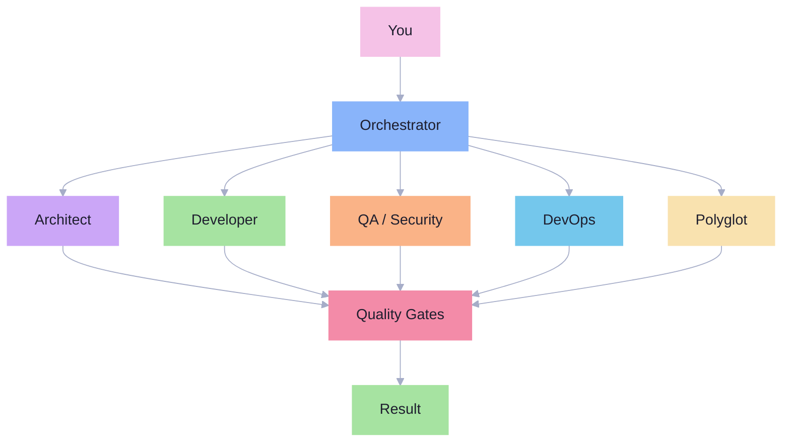
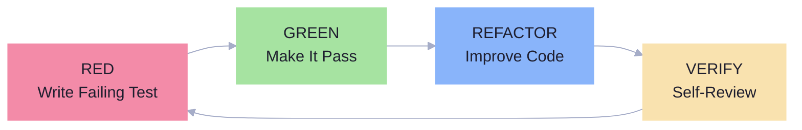

## What Is This?

Most AI coding tools help with the **visible 20%** of software engineering: writing code. But professional developers spend 80% of their time on everything *around* the code -- reading existing systems, recognizing patterns, estimating effort, reviewing their own work, managing technical debt, thinking about security.

**10X Developer Unicorn** is a Claude Code plugin that encodes that hidden 80%. It transforms Claude Code from a single AI assistant into a **coordinated team of 6 specialized agents** with 18 skills that mirror how senior engineers actually work.

The result: Claude Code that doesn't just write code -- it reads codebases strategically, enforces TDD discipline, self-reviews before committing, estimates with risk buffers, and manages technical debt deliberately.

---

## One Command Install

```bash
claude plugin install aj-geddes/unicorn-team
```

That's it. Skills are discovered automatically. Hooks are wired. The orchestrator activates.

---

## How It Works

The orchestrator analyzes every task and routes it to the right specialist. Each agent gets a fresh 200K context window, so you never run out of room.



---

## The 18 Skills

### Agent Skills

These are the specialized agents that execute work. Each runs in its own context window with domain-specific expertise.

| Skill | What It Does |
|-------|-------------|
| **orchestrator** | Routes tasks, coordinates agents, enforces quality gates |
| **architect** | System design, ADRs, API contracts, tradeoff analysis |
| **developer** | TDD-first implementation across Python, JS/TS, Go, Rust |
| **qa-security** | Code review, security audits, OWASP analysis, quality gates |
| **agent-devops** | CI/CD pipelines, Kubernetes, Terraform, deployment strategies |
| **polyglot** | Rapid language acquisition, cross-ecosystem migration |

### Meta Skills

These encode the "hidden 80%" -- the engineering judgment skills that separate senior developers from code generators.

| Skill | What It Does |
|-------|-------------|
| **code-reading** | Strategic codebase comprehension: entry points, data flow, impact analysis |
| **pattern-transfer** | Recognizes problem classes, transfers solutions across languages and domains |
| **self-verification** | Pre-commit self-review protocol: catches issues before they reach code review |
| **estimation** | Risk-based estimation with PERT formula, decomposition, and confidence levels |
| **technical-debt** | Deliberate debt tracking, classification, prioritization, and paydown planning |
| **language-learning** | Structured 5-phase protocol for rapid paradigm and language acquisition |
| **hvs-skill-buddy** | Meta-skill for auditing, creating, and maintaining skills |

### Domain Skills

Language-specific idioms, tooling, and patterns that agents draw on during execution.

| Skill | What It Does |
|-------|-------------|
| **python** | Modern Python idioms, pytest patterns, ruff/mypy tooling, project structure |
| **javascript** | TypeScript, React, Node.js, ESLint/Prettier, vitest/jest patterns |
| **testing** | Test strategy, TDD patterns, mocking, coverage, flaky test debugging |
| **security** | Defense-in-depth, threat modeling, OWASP patterns, secure coding |
| **domain-devops** | Containerization, CI/CD patterns, Kubernetes, observability |

---

## TDD Built In

Every implementation follows a strict test-driven cycle. The developer agent will not write production code without a failing test first.



No exceptions. No shortcuts. Tests define the contract before code fills it.

---

## Get Started

```bash
claude plugin install aj-geddes/unicorn-team
```

Then ask Claude Code to build something. The orchestrator takes it from there.

[Getting Started Guide]({{ site.baseurl }}/getting-started/) -- walkthrough your first task with detailed examples.

[Skills Deep Dive]({{ site.baseurl }}/skills/) -- explore all 18 skills and how they compose.

[Architecture]({{ site.baseurl }}/architecture/) -- understand the orchestrator-first design.
